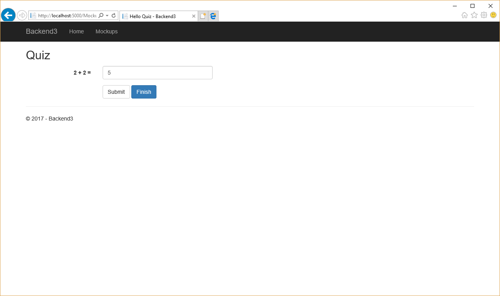
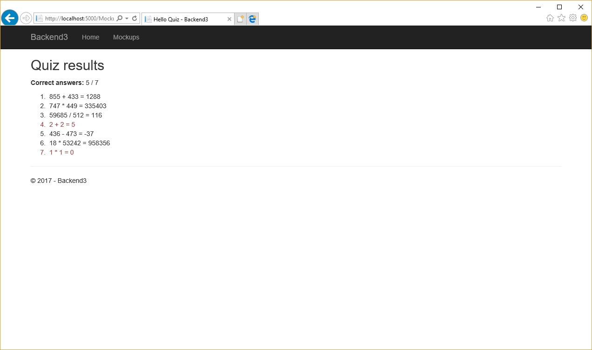

# Практика №3

## Темы

1. Интеграция сверстанных макетов страниц в веб-приложение
2. Сохранение состояния формы
3. ModelBinding и массивы
4. Сброс значения полей формы
4. Определение выбранного пользователем действия на форме

## Задачи

1. Ознакомиться с заготовленным проектом.
2. В заготовленном проекте:
   1. Определить, реализовать и зарегистрировать службы:
      * Служба, генерирующая случайные целые числа в заданном диапазоне.
      * Служба, позволяющая выполнять основные арифметические операции над целыми числами (+, -, *, /).
   2. Реализовать контроллер, который будет использовать эти службы для того, чтобы
      * Генерировать 2 случайных целых числа и случайную арифметическую операцию.
      * Запрашивать у пользователя результат выполнения сгенерированной арифметической операции над сгенерированными числами.
      * Предлагать пользователю 2 действия:
         * сохранить ответ и перейти к следующему вопросу;
         * сохранить ответ и закончить тест.
      * Сохранять ответ пользователя, а также сгенерированные операции и числа.
      * После завершения теста пользователем - вывести отчет о его правильных и неправильных ответах.
   3. Реализовать набор представлений для этого контроллера на основе макетов из ~/Views/Mockups.
   4. Из представления Home/Index сделать ссылки на дейсвия нового контроллера.

## Результат





## Материалы

### Интеграция сверстанных макетов

При командной работе над проектом и явном разделении ролей frontend-разработчик и backend-разработчик, backend-разработчик зачастую получает уже сверстанные макеты страниц, которые ему необходимо интегрировать в веб-приложение.
В процессе такой интеграции ему может потребоваться (включая, но не ограничиваясь):

1. Заменить константные значения, определенные в макете страницы, на значения, получаемые из контроллера

Before:
```html
<div class="form-group">
    <span class="col-md-2"><strong>Current value:</strong></span>
    <span class="col-md-10">5</span>
</div>
```

After:
```html
<div class="form-group">
    <span class="col-md-2"><strong>Current value:</strong></span>
    <span class="col-md-10">@Model.CurrentCount</span>
</div>
```

2. Выводить повторяющиеся элементы с помощью цикла

Before:
```html
<ol>
    <li>Increase</li>
    <li>Increase</li>
    <li>Increase</li>
    <li>Decrease</li>
    <li>Increase</li>
    <li>Increase</li>
    <li>Increase</li>
</ol>
```

After:
```html
<ol>
    @foreach (var action in Model.Actions)
    {
        <li>@action</li>
    }
</ol>
```

3. Определять адреса ссылок и форм (а возможно и сами формы)

Before:
```html
<form class="form-horizontal">
```

After:
```html
<form asp-action="Index" class="form-horizontal">
```

4. Определять имена (или привязку к свойства) для элементов форм:

Before:
```html
<button class="btn btn-default">Increase</button>
```

After:
```html
<button type="submit" name="Action" class="btn btn-default" value="Increase">Increase</button>
```

5. Определять дополнительные поля, необходимые для работы формы:

Before:
```html
```

After:
```html
<input type="hidden" asp-for="CurrentCount"/>
@if (Model.Actions != null)
{
    for (var i = 0; i < Model.Actions.Count; i++)
    {
        <input type="hidden" asp-for="@Model.Actions[i]"/>
    }
}
```

### Сохранение состояния формы

К форме можно прикладывать одно или несколько скрытых полей с помощью элемента `<input type="hidden" />`. Данные элементы не будут видны пользователю, но их имя и значение будут передавать на сервер при отправке формы.
В этих полях можно хранить некоторую вспомогательную информацию для формы, не требующей взаимодействия с пользователем, но необходимой для дальнейшей обработки формы.  
Важно: несмотря на то, что пользователь не может взаимодействовать с этими элементами, ничего не мешает ему, используя встроенные в браузер средства отладки, узнать их значения и внести в их изменения.

Пример:

```html
<input type="hidden" asp-for="CurrentCount"/>
```

### ModelBinding и массивы

Если необходимо принять через механизм ModelBinding массив, то элементы, его поставляющие должны быть оформлены следующим образом:
* Если это массив примитивных значений, то для каждого значения должен быть определен элемент с именем следующего формата: `Items[0]`, `Items[1]`, `Items[2]` и т.д. (Items - имя свойства, в которое необходимо забиндить массив).
* Если это массив объектов конкретного (не абстрактного) класса, то для каждого элемента массива и для каждого свойства объекта должен быть определен элемент с именем следующего формата: `Items[0].X`, `Items[0].Y`, `Items[1].X`, `Items[1].Y` и т.д. (Items - имя свойства, в которое необходимо забиндить массив, X и Y - свойства объектов, содержащихся в массиве)
* Если это массив объектов абстрактного класса, то необходимо реализовать свой ModelBinder для их приема.

Пример:
```
@for (var i = 0; i < Model.Actions.Count; i++)
{
    <input type="hidden" asp-for="@Model.Actions[i]"/>
}
```

### Сброс значений полей формы

Если в результате метода POST, необходимо отобразить пользователю какую либо страницу с измененными значениями свойств, которые были получены через ModelBinding, то можно столкнутся с ситуацией, когда простое измненеия свойства в объекте класса модели не отражается на странице. Это происходит потому, что ASP.NET устанавливает значения элементов форм в первую очередь из ModelState-а, и только в случае отсутствия там упоменания свойства смотрит на реальную модель.
Для того, чтобы все таки поменять значение свойства (и отразить это в соответствующем элементе), можно удалить свойство из ModelState-а с помощью метода `Remove`.

Пример:
```csharp
this.ModelState.Remove("CurrentCount");
```

### Определение выбранного действия

Использование элемента `<button type="submit">` для отправки данных формы позволяет относительно несложно различать, какую кнопку в итоге нажал пользователь.
Для этого элементу `<button>` необходимо назначить имя (атрибут `name`), а также значение (атрибут `value`). В таком случае, если отправка формы будет вызвана нажатием на эту кнопку, то в множество пар ключ-значение, передаваемых на сервер будет включены и `name` & `value` нажатой кнопки (все другие кнопки будут проигнорированы).

Пример:

```html
<button type="submit" name="Action" class="btn btn-default" value="Decrease">Decrease</button>
```

```csharp
public IActionResult Index(CounterAction action, CounterViewModel model)
{
    // ...
}
```

При нажатии на кнопку `Decrease`, в параметру `action`, передаваемый в метод `Index` будет присвоено значение `CounterAction.Decrease`.

